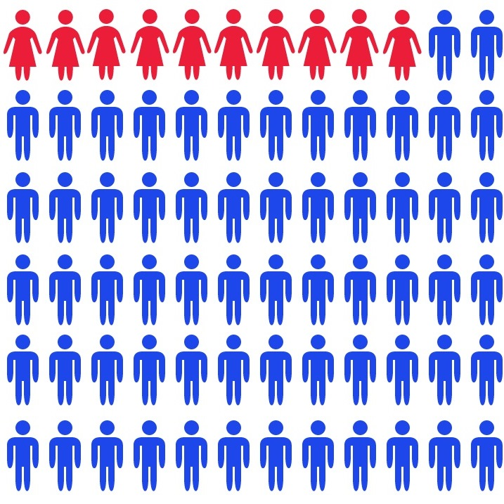
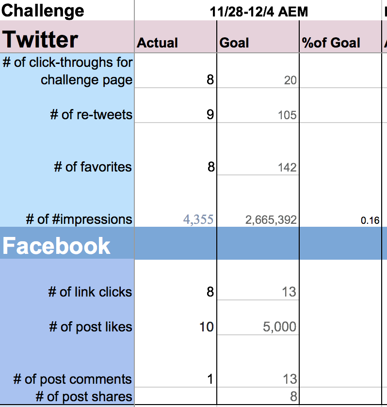
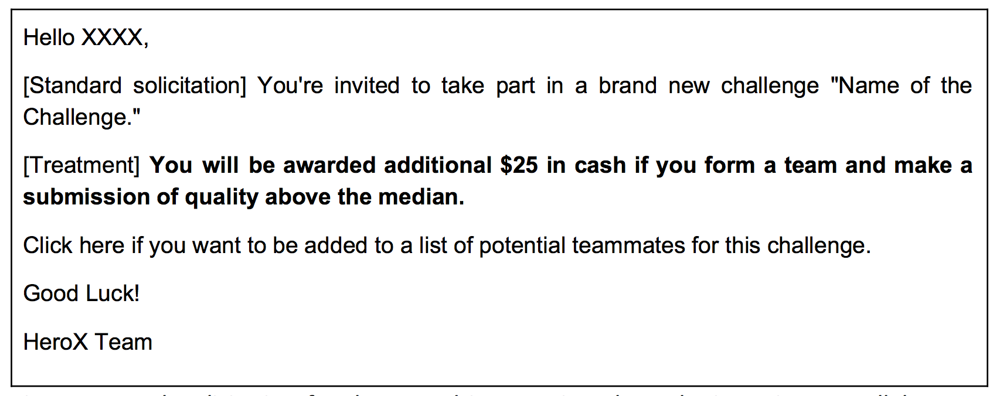

```{r setup, echo=FALSE, message=FALSE}
source("func.R")
```

Introduction
============

Women Contribute Online Less Than Men
------------------------------ 

> - Only 13% women contributors on Wikipedia
  - Wikipedia entries about women are less likely to be complete
  - Only 5% women contributors on StackOverflow
  - Less than 5% women taking part in programming competitions (despite 30% in CS schools)

Implications for individuals, firms & society
------------------------------ 

> 	- Narrow participation $\leadsto$ lower profits
  	- Less diversity & creativity for innovation
	- Labor market discrimination
	- Platform content may reflect biased views


A theory of gender imbalance
------------------------------ 

We conjecture:

> 	- **Gamification** & Incentives (e.g., competition, points, rankings)
  	- Gender differences in **preferences** (e.g., risk aversion, competitive inclination)

Mechanisms under investigation

1. Perceived gender composition in a competitive environment
2. \color{gray}{Collaboration incentives under gender imbalance [next study]}


Bayesian updating
-----------------



Role model
----------

\begin{figure}
\centering
\includegraphics[width=0.5\textwidth]{tap_water_pinker.jpg}
\includegraphics[width=0.5\textwidth]{tap_water_basket.jpg}
\caption{do I want to be successful in this?}
\end{figure}

---


Context and Data (HeroX.com)
===========================

```{r stats, echo=FALSE} 
g <- table(herox$Gender, ifelse(herox$Num.challenges>0, "Contrib", "Not"))
sex.ratio <- round(apply(g, 1, sum)["male"] / apply(g, 1, sum)["female"])
sex.ratio.contrib <- round(g["male","Contrib"] / g["female","Contrib"])
```

Gender participation in Herox.com 
----------------------------------

The sex ratio is:

- `r sex.ratio` men registrants for each woman 
	(`r round(100/(sex.ratio+1))` percent women)
- `r sex.ratio.contrib`  men contributing for each woman 
	(`r round(100/(sex.ratio.contrib+1))` percent women)

----

```{r bayes, echo=FALSE, fig.cap="Proportion of women members by country"}
###### BAYES ##########################
dat <- subset(herox, !is.na(Gender) & !is.na(Country))
n <- tapply(dat$Gender, dat$Country, length)
top.countries <- names(tail(sort(n), 10))
agg <- data.frame(table(Gender=dat$Gender, Country=dat$Country))

# GLM with weights (inference is wrong!)
fit <- glm(Gender=="female" ~ Country, data=agg, weights=agg$Freq)

# Bayesian GLM
fit2 <- bayesglm(Gender=="female" ~ Country, data=agg, weights=agg$Freq, family=binomial)

# Predictions
yhat <- predict(fit2, type='response', newdata=data.frame(Country=levels(agg$Country)))
est <- data.frame(Country=levels(agg$Country), yhat)
w <- tapply(agg$Freq, agg$Country, sum)/850

set.seed(3) # For positioning labels
par(mar=c(1,4,1,3), family='serif')
plot(est[, 2], cex=w, bty='n', ann=FALSE, xaxt="n", pch=21
	, bg=transp.color("brown"), xpd=TRUE
	, ylim=c(0, 0.8), xlim=c(1, length(w)+10))
sapply(1:10, function(x) {
	x <- top.countries[x]
	X <- est[which(est[ ,1]==x), ]
	w.1 <- w[names(w)==x]
	points(X, col=transp.color(palette()[x]), cex=w.1, xpd=TRUE)
	text(X, x, xpd=TRUE, pos=sample(4))
}) -> z
mtext("Proportion women", 2, 3)
```

----

```{r overtime, echo=FALSE, fig.cap="Proportion of women new members over time"}
dat <- subset(herox, !is.na(Gender) & !is.na(Country))
dat[order(dat$Registration.date), ] -> dat

# Limit dates
min.date <- min(dat$Registration.date)
max.date <- max(dat$Registration.date)

# Split time into units of 20 days
tens <- as.numeric(dat$Registration.date - min.date) %/% 20
y <- tapply(dat$Gender=='female', tens, mean)
x <- as.numeric(names(y))
z <- cbind(x[-c(1:4)], y[-c(1:4)])

# Plot
par(mar=c(3,4,1,1), family='serif')
plot(z, type='b', pch=21, bg=2, col=2, xaxt="n", bty="n", ylab="Proportion women")
abline(h=0.5, lty=2, col=2)

dates <- pretty(20*z[,1]  + min.date)
tens2 <- as.numeric(dates - min.date) %/% 20
axis(1, at=tens2, format(dates,'%Y'))
grid(nx=NA, ny=NULL)
```

---

```{r cumsum, echo=FALSE, fig.cap="Cumulative proportion of women over time"}
dat <- subset(herox, !is.na(Gender) & !is.na(Country) & difftime(Registration.date,"2014-01-01")>0)
dat[order(dat$Registration.date), ] -> dat
female <- dat$Gender=='female'
female.active <- dat$Gender=='female' & dat$Num.challenges>0

female.pc <- cumsum(female) / 1:nrow(dat)
female.active.pc <- cumsum(female.active) / 1:nrow(dat)
n <- nrow(dat)
#
par(mar=c(3,4,1,1), family='serif')
plot(dat$Registration.date, female.pc, type="l", bty="n")
lines(dat$Registration.date, female.active.pc, type="l", col=2)
text(dat$Registration.date[n], female.active.pc[n], "Contributing", 1, xpd=T)
text(dat$Registration.date[n], female.pc[n], "Registered", 1, xpd=T)
```


Experimental design
===================

Winning members as "Role models"
-----------


Randomized intervention
-----------------

Send solicitation with $k$ role models to $60K$ HeroX members

\[
	\text{possible combinations} = \binom{m + f}{k} 
\]

### Example ($k=2$, $m=8$ and $f=8$)

$16! / (14! 2!) = 16 * 15 / 2 = 120$ possible combinations $\leadsto$ $60000/120=500$ subjects per combination

### Example ($k=3$ $m=6$ and $f=6$)

$12! / (9! * 3!) = 12 * 11 * 10 / 6 = 220$ possible combinations $\leadsto$ $\approx 270$ subjects per combination.

How to pick $m$, $f$, and $k$?
------------------------------

- Recruited 19 profiles (11 men and 8 women)

- Examined and scored each profile according to:
	* Physical attractiveness
	* Perceived age
	* Perceived ethnicity
	* "Role model"

- Select $f$ and $m$ such that scores are balanced

- Select $k$ that gives high power

The problem of causality
------------------------

### What we identify?

- "Causal effects" for (1) individuals & (2) profile combinations

- Further assumptions needed for **interactions** (e.g., same gender, ethnicity)  and **gender composition** [best we can do without "lying"]

### Which "causal effects"?

- Intention-To-Treat (ITT) which ignores anything that happens after randomization.

- Complier Average Causal Effect (CACE) which considers the effect on those who comply (i.e., who open their emails)


Data analysis
------------------------

Let $Y(W)$ be the outcome given the assignment $W$ that is 1 when there are same-something role models (e.g., gender, ethnicity).

The ITT can be estimated with
\[
	E[Y(1)] - E[Y(0)] = \sum \frac{y_{i1}}{n_1} - \sum \frac{y_{i0}}{n_0}
\]

One possible limitation of ITT estimation is that gender may be correlated with other observable or unobservable characteristics


Regression analysis
--------------------

To control for confounding factors, we use the following model:
\[
	Y_{ij} = \alpha_i + \beta_j + \sum_{k=1}^K \gamma_k\text{SameEthnic}_{ijk} + \sum_{k=1}^K\delta_k\text{SameSex}_{ijk} + e_{ij}
\]
for $i$ subject and $j$ combination of $k=1,2,..., K$ role models.

When $\gamma_k=\gamma$ or $\delta_k=\delta$ for all $k$, only the count of same-somthing matters!


Example email solicitation
----------------------


Treatment
----------

- Vary gender composition (look at "Tokenism")
- Vary "success" composition

```{r, echo=FALSE, results="asis"}
#
x <- c("3 women","1 man 2 women", "2 men 1 woman", "3 men")
y <- c("1 man role model", "1 woman role model")

print(xtable(expand.grid(y, x), caption="Treatment combinations"), comment=FALSE, booktabs=FALSE)
```

Facebook/Twitter ads
--------------




Validation of profiles
----------------------

Goal: comparable profiles 

Use demographics + in the lab ratings of 20-30 profiles

- Physical attractiveness (based on user profile picture)
- Role model (bio description + picture)
- Skills

Timing of the experiment
-------------------------

1. Preliminary survey (calibrate perceived gender composition)
2. Solicitation (email sent 1-2 times)
3. Ex-post survey (detect possible changes on perceived gender composition)

- Outcome variables: participation, effort, team formation, etc.

Example survey
-------------

1. Demographics (age, gender)
2. Motivations to participate in HeroX
	- [Cash prizes]
	- [Learning]
	- [CV/job opportunity]
	- [Help society]
2. What challenges do you like?
	- [STEM]
	- [Social impact]
	- [else]
3. Estimate platform composition?
	- [Gender]
	- [Age]


Next steps
----

1. Identify profiles and ask for their consent (picture)
2. Recruit students to validate profiles
3. Send out preliminary survey
4. Ultimate solicitation message
5. Ads campaign with profiles 
6. Examine results


Collaboration incentives
========================

Basic idea
---------

1. Male-female rich environment (how many teams?)
2. Splitting the pie rules (how many teams?)
3. Self-confidence

Technical requirements
----------------------

- Creating non-overlapping lists of potential teammates 
- Randomize composition of pool of potential teammates
- Offer different incentives

Example teaming
----------------




Thanks
=======

Demand estimation of the challenges
===================================

Basic idea
----------

Launch `LinkedIn` campaign offering different pricing schemes 

Examples:

1. Fees vs no fees
2. Subsidizing prize money
3. Information treatment


<!-- 

TODOS
-----

- Ask HeroX about winners

- Ask Facebook ads

- Tokenism

Interesting paper:

https://papers.ssrn.com/sol3/papers.cfm?abstract_id=2804265

 -->

