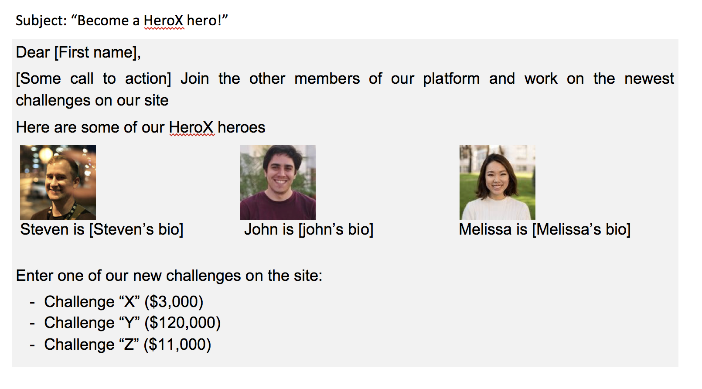

```{r setup, echo=FALSE, message=FALSE}
require(xtable)
```

Introduction
=============

Women Contribute Online Less Than Men
------------------------------ 

> - Only 13% women contributors on Wikipedia
  - Wikipedia entries about women are less likely to be complete
  - Only 5% women contributors on StackOverflow
  - Less than 5% women taking part in programming competitions (despite 30% in CS schools)


Implications for individuals, firms & society
------------------------------ 

**Profit loss** for online companies (e.g., Airbnb)

+ Narrow participation
+ Less diversity & creativity for innovation

. . .

**Labor market discrimination**

+ Signaling skills
+ Learning

. . .

**Cultural** discrimination

+ Platform content may reflect biased views


A theory of gender imbalance
------------------------------ 

Many factors to consider  (see Lam et. al 2011)

We conjecture:

- **Gamification** & Incentives (e.g., competition, points, rankings)
- Gender differences in **preferences** (e.g., risk aversion, competitive inclination)

. . .

**Mechanisms**  under investigation

1. Perceived gender composition in a competitive environment.
2. \color{gray}{Collaboration incentives under gender imbalance [next study]}

The role of the perceived gender imbalance
==========================================

<!-- Why the perceived gender imbalance matters?   -->

Bayesian updating
------------------------------ 


Role model
------------------------------ 

\begin{figure}
\centering
\includegraphics[width=0.5\textwidth]{tap_water_pinker.jpg}
\includegraphics[width=0.5\textwidth]{tap_water_basket.jpg}
\caption{do I want to be successful in this?}
\end{figure}


---


# Context and Data

## Herox.com 

The sex ratio is:

- **2 men registrants** for a woman (33 percent women)
- **2.8 men contributors** for a women (26 percent women)

----


----


##  How to influence the perceived gender composition?

Solicitation via email featuring 2-3 member profiles.

- experience + bio + profile picture

- ADD regression controls for past experience on platform

## Example



## Treatment

- Vary gender composition
- Vary "success" composition

```{r, echo=FALSE, results="asis"}
x <- c("3 women","1 man 2 women", "2 men 1 woman", "3 men")
y <- c("1 man role model", "1 woman role model")
print(xtable(expand.grid(x, y), caption="Treatment combinations")
	, comment=FALSE, booktabs=FALSE)
```

## Validation of profiles

Goal: comparable profiles 

Use demographics + AMT ratings of 20-30 profiles

* Physical attractiveness (based on user profile picture)
* Role model (bio description + picture)
* Skills

## Timing of the experiment

1. Preliminary survey (calibrate perceived gender composition)
2. Solicitation (email sent 1-2 times)
3. Ex-post survey (detect possible changes on perceived gender composition)

- Outcome variables: participation, effort, team formation, etc.

## Next steps

- Experiment on teaming on the platform
- Wikipedia collaboration

## Example teaming


## Treatments

1. Male-female rich environment (how many teams?)
2. Splitting the pie rules (how many teams?)
3. Confidence

## TODOS

- Ask HeroX about winners

- Ask Facebook ads

- Tokenism

Interesting paper:

https://papers.ssrn.com/sol3/papers.cfm?abstract_id=2804265


